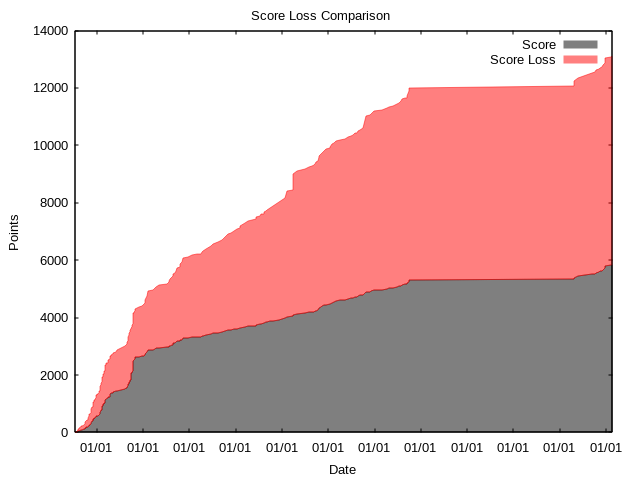

# gittutor

gittutor is a small command line game designed to help you improve your usage of git.
The tool generates a score for your commits based on various subjectively nice to follow rules such as the formatting of the commit message.

When gittutor is executed on a local git repository it produces a top 10 list of all the best git user that contributed to the repository.
Below an example of this can be seen on the LibAFL git repo:
```
$ gittutor
#1      (8744)  Andrea Fioraldi andreafioraldi@gmail.com
#2      (5613)  Dominik Maier domenukk@gmail.com
#3      (2397)  Dongjia Zhang tokazerkje@outlook.com
#4      (1905)  s1341 s1341@users.noreply.github.com
#5      (1144)  Toka tokazerkje@outlook.com
#6      (1032)  Dominik Maier dmnk@google.com
#7      (904)   David CARLIER devnexen@gmail.com
#8      (742)   julihoh julihoh@users.noreply.github.com
#9      (571)   Dongjia "toka" Zhang tokazerkje@outlook.com
#10     (350)   Evan Richter evanjrichter@gmail.com
```

If you want to find out why you lost points simply specify an author.
The program will then produce plot which helps you visualize why you lost points so you can improve.

```
$ gittutor -a s1341
#4      (1905)  s1341 s1341@users.noreply.github.com

                             Score Loss Comparison                             
                                                                               
     2000 +-------------------------------------------------------------+      
          |                                                             |      
     1800 |+                                              Score +-----++|      
          |                                          Score Loss +-----+ |      
     1600 |+                                                          XX|      
     1400 |+                                                       XXXXX|      
          |                                                       XXXXXX|      
     1200 |+                                                     XXXXXXX|      
          |                                                   XXXXXXXXXX|      
     1000 |+                                                XXXXXXXXXXXX|      
          |                                                 XXXXXXXXXXXX|      
      800 |+                                          XXXXXXXXXXXXXXXXXX|      
          |                              XXXXXXXXXXXXXXXXXXXXXXXXXXXXXXX|      
      600 |+                             XXXXXXXXXXXXXXXXXXXXXXXXXXXXXXX|      
      400 |+                        XXXXXXXXXXXXXXXXXXXXXXXXXXXXXXXXXXXX|      
          |                        XXXXXXXXXXXXXXXXXXXXXXXXXXXXXXXXXXXXX|      
      200 |+                  XXXXXXXXXXXXXXXXXXXXXXXXXXXXXXXXXXXXXXXXXX|      
          |                XXXXXXXXXXXXXXXXXXXXXXXXXXXXXXXXXXXXXXXXXXXXX|      
        0 +-------------------------------------------------------------+      
          01/07  01/05   01/03  01/01   01/11  01/09   01/07  01/05   01/03    

```

By default the plot written to stdout its also possible to get a more detailed view of the plot with the `--nice` flag.
```
$ gittutor --nice --author "Arnaud Roques"
```



For more usages look at `gittutor --help`.

## Build
Make sure gnuplot is installed then run:
```
cargo build -r
```
